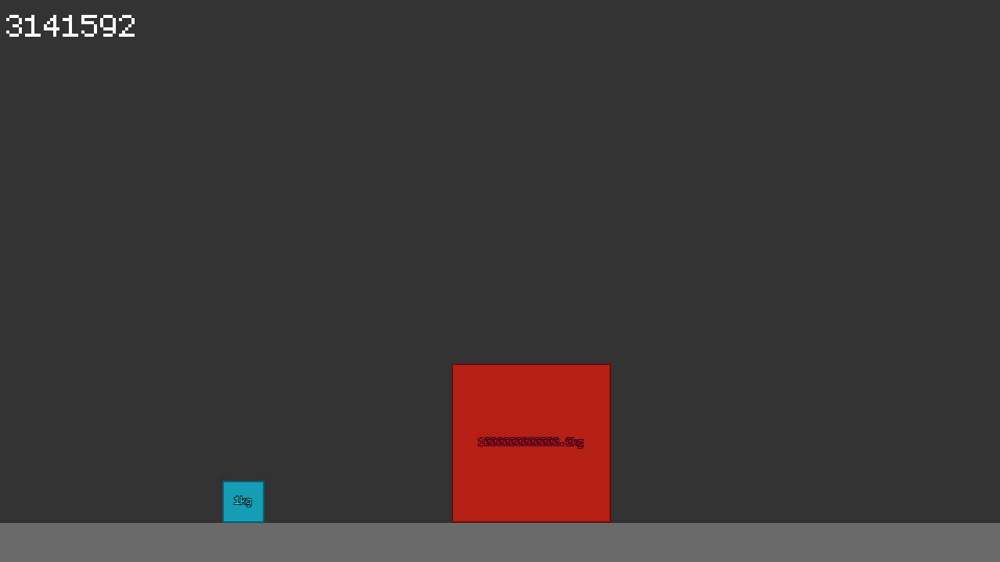

# HitDaPie
Check out  [3blue1brown video explanation](https://www.youtube.com/watch?v=jsYwFizhncE) .



## Requirements
 - [SFML](https://www.sfml-dev.org/) library
 - g++

## Usage
```console
$ ./build
```

## Controls
|Keys|Desc|
|---|---|
|<kbd>Escape</kbd>|Quit|
|<kbd>P</kbd>|Pause|
